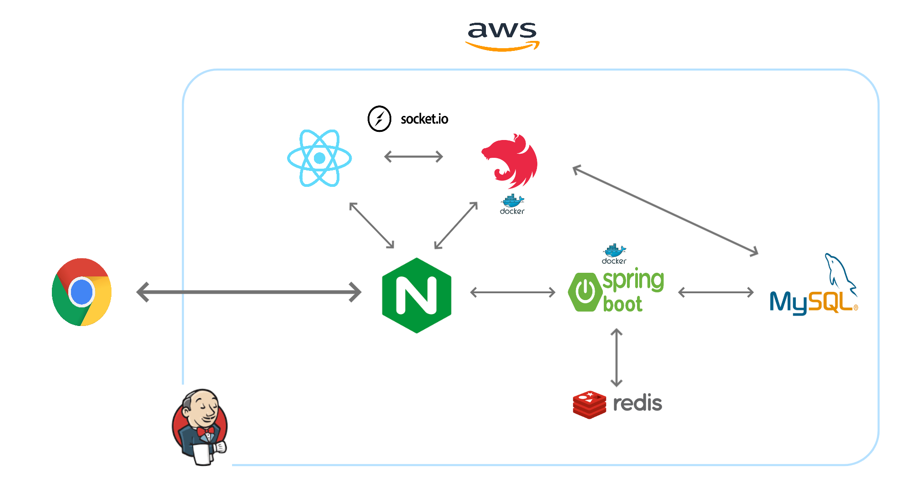
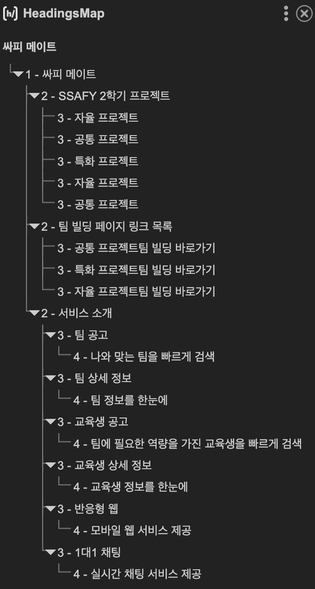
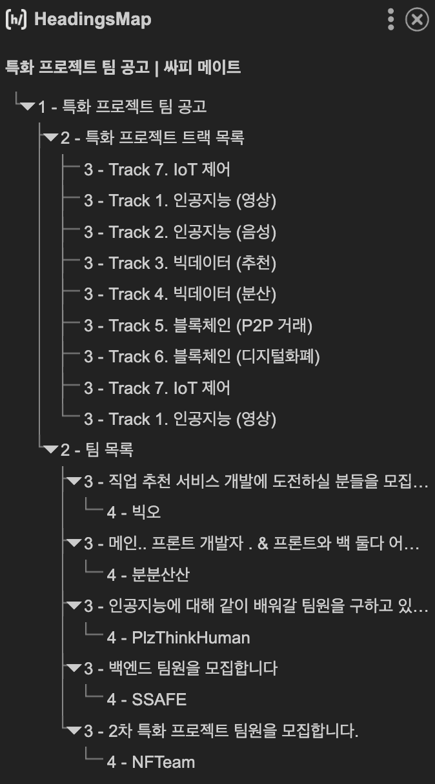
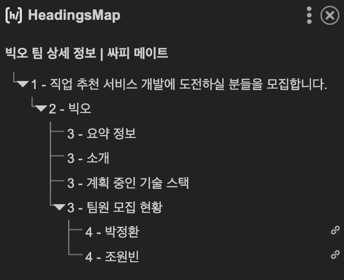
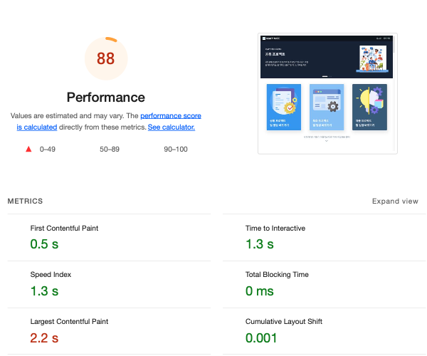
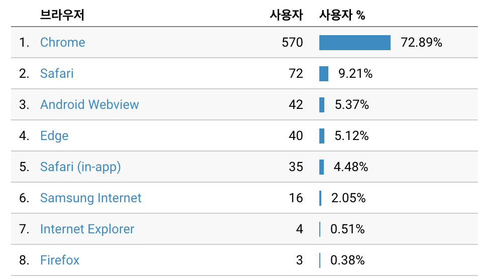

<div align="center">
  <br />
  
  <br />
  <h1>싸피 메이트 (SSAFY MATE)</h1>
  <div>
    
    
  </div>
  <br />
</div>

## 목차

1. [**웹 서비스 소개**](#1)
1. [**버전 기록**](#2)
1. [**기술 스택**](#3)
1. [**주요 기능**](#4)
1. [**프로젝트 구성도**](#5)
1. [**데모 영상**](#6)
1. [**특이사항**](#7)
1. [**구글 애널리틱스 통계**](#8)
1. [**개발 팀 소개**](#9)
1. [**개발 기간 및 일정**](#10)
1. [**실행 방법**](#11)

<br />

<div id="1"></div>

## 💁 웹 서비스 소개

**싸피 메이트(SSAFY MATE)** 는 삼성 청년 SW 아카데미 교육 과정 중 2학기 팀 프로젝트 기간의 팀 빌딩을 도와주는 서비스입니다.

싸피 메이트는 팀 공고 서비스를 통해 팀들의 정보를 비교하고 검색 폼을 통해 내가 원하는 프로젝트 트랙, 직무, 기술 스택 등을 검색하여 내게 꼭 맞는 팀을 찾을 수 있습니다.

교육생 공고 서비스를 통해서는 교육생들의 정보를 한눈에 확인하고 검색 폼을 통해 나의 팀에 필요한 직무, 기술 역량 등을 갖춘 교육생을 찾을 수 있습니다.

내가 원하는 팀 또는 교육생을 찾았다면 싸피 메이트가 제공하는 팀 지원 및 팀 합류 요청 기능을 통해 팀에 합류하거나 팀을 구성할 수 있습니다.

<br />

- '싸피 메이트' 게스트 계정 정보

|  아이디  | ssafymate@gmail.com |
| :------: | :------------------ |
| 비밀번호 | ssafymate123        |

> 서비스를 구경하고 싶으시다면 상단의 계정 정보로 로그인 후 사용하실 수 있습니다.

<br />

[**🔗 배포된 웹 서비스로 바로가기 Click !**](https://ssafymate.site/) 👈

[**🔗 서비스 소개 영상 바로가기 Click !**](https://youtu.be/0q4h3c69dXg) 👈

[**🔗 프론트엔드 저장소 바로가기 Click !**](https://github.com/ssafy-mate/ssafy-mate_front-end) 👈

[**🔗 백엔드(메인 서버) 저장소 바로가기 Click !**](https://github.com/ssafy-mate/ssafy-mate_back-end) 👈

[**🔗 백엔드(채팅 서버) 저장소 바로가기 Click !**](https://github.com/ssafy-mate/ssafy-mate_back-end_with-chatting) 👈

> 새 창 열기 방법 : CTRL+click (on Windows and Linux) | CMD+click (on MacOS)

<br />

<div id="2"></div>

## 👷 버전 기록

|   버전    | <div align="center">업데이트 내용</div>                                                                                                                                                                                                                                                                                                                                         | 업데이트 날짜 |
| :-------: | :------------------------------------------------------------------------------------------------------------------------------------------------------------------------------------------------------------------------------------------------------------------------------------------------------------------------------------------------------------------------------ | :-----------: |
| `v1.2.10` | - 푸터의 깃허브 링크 주소 수정                                                                                                                                                                                                                                                                                                                                                  |   22.04.05.   |
| `v1.2.9`  | - 이메일 인증 코드 만료 오류 수정                                                                                                                                                                                                                                                                                                                                               |   22.03.30.   |
| `v1.2.8`  | - 팀 합류 요청 다이얼의 옵션 요소 위치 오류 수정                                                                                                                                                                                                                                                                                                                                |   22.03.29.   |
| `v1.2.7`  | - 웹 성능 최적화(다이얼 창 지연 로딩 적용)                                                                                                                                                                                                                                                                                                                                      |   22.03.20.   |
| `v1.2.6`  | - 채팅 서비스 로직 수정<br />- 웹 성능 최적화(Code Splitting 적용)<br />                                                                                                                                                                                                                                                                                                        |   22.03.17.   |
| `v1.2.5`  | - 홈 배너 애니메이션 파일들을 기본 이미지 파일로 교체<br />- 프로젝트 트랙 소개 배너 mp4 파일들을 webp 파일 형식으로 교체<br />- 페이지 헤딩 처리 개편                                                                                                                                                                                                                          |   22.03.16.   |
| `v1.2.4`  | - 프로젝트 트랙 소개 배너 gif 파일 mp4 파일로 변경<br />- 서비스 Description 수정<br />- 서비스 로고 이미지 최적화                                                                                                                                                                                                                                                              |   22.03.14.   |
| `v1.2.3`  | - 채팅 서버 URL 수정                                                                                                                                                                                                                                                                                                                                                            |   22.03.07.   |
| `v1.2.2`  | - 첫 페이지 웹 성능 최적화<br />- 페이지 헤딩 처리 수정                                                                                                                                                                                                                                                                                                                         |   22.03.07.   |
| `v1.2.1`  | - 푸터 유튜브 아이콘에 서비스 소개 UCC 영상 링크 연결                                                                                                                                                                                                                                                                                                                           |   22.02.20.   |
| `v1.2.0`  | - 받은 제안 및 보낸 요청 항목 삭제 기능 추가<br />- 채팅 목록 리스트에서 선택된 채팅방 표시 기능 추가<br />- 받은 제안 및 보낸 요청 페이지 UI 개선<br />- 기술 스택 선택 옵션 추가<br />- 모집 마감 토글 버튼 클릭 시 페이지네이션 미초기화 오류 수정                                                                                                                           |   22.02.17.   |
| `v1.1.1`  | - 소켓 서버 연결 오류 해결                                                                                                                                                                                                                                                                                                                                                      |   22.02.15.   |
| `v1.1.0`  | - 채팅 페이지 사용자 접속 ON/OFF 표시 기능 추가<br />- 프로젝트 트랙 소개 배너 이미지 추가<br /> - 받은 제안 및 보낸 요청 목록 시간순 정렬 적용 및 UI 수정<br /> - 헤더 마이 메뉴 창 UI 수정<br />- 팀 소개, 자기소개 입력 창 오토사이즈 오류 수정<br /> - 기술 스택 입력 및 수정 시 엔터키 인식 오류 수정                                                                      |   22.02.15.   |
| `v1.0.6`  | - 채팅 페이지 프로필 이미지 CSS 중첩 오류 수정<br />- 채팅 페이지의 상대방 프로필 링크 UI 개선<br /> - 홈 페이지의 모바일 서비스 소개 부분 PC, Mobile 이미지 스타일링 수정<br /> - 공고 페이지 필터 옵션 변경시 페이지 설정 미초기화 오류 수정<br />- 교육생 공고 페이지 공유하기, 메시지 보내기 버튼 UI 수정<br /> - 팀 생성 및 수정 텍스트 입력 폼 입력 텍스트 길이 제한 추가 |   22.02.14.   |
| `v1.0.5`  | - 헤더 네비게이션 링크 오류 수정<br />- 모바일 서비스 소개 이미지 위치 재조정                                                                                                                                                                                                                                                                                                   |   22.02.13.   |
| `v1.0.4`  | - 받은 제안 및 보낸 요청 아이템 상태 박스 배치 오류 수정 수정                                                                                                                                                                                                                                                                                                                   |   22.02.13.   |
| `v1.0.3`  | - 기술 스택 입력란에서의 백스페이스 입력 오류 수정                                                                                                                                                                                                                                                                                                                              |   22.02.13.   |
| `v1.0.2`  | - 프로젝트 트랙 선택을 로그인 후 바로 실행으로 로직 수정<br />- 채팅 페이지 채팅방 선택이 없을 시 생기는 오류 수정                                                                                                                                                                                                                                                              |   22.02.12.   |
| `v1.0.1`  | - 회원가입 2단계 오류 문구 수정                                                                                                                                                                                                                                                                                                                                                 |   22.02.12.   |
| `v1.0.0`  | - 싸피 메이트 서비스 오픈                                                                                                                                                                                                                                                                                                                                                       |   22.02.12.   |

<br />

<div id="3"></div>

## 🛠 기술 스택

### **Front-end**

|  |  |  |
| :----------------------------------------------------------------------------------------------------------------------------: | :--------------------------------------------------------------------------------------------------------------------------: | :-----------------------------------------------------------------------------------------------------------------------------: |
|                                                             HTML5                                                              |                                                             CSS3                                                             |                                                           TypeScript                                                            |

|  |  |  |  |
| :-------------------------------------------------------------------------------------------------------------------------------: | :-------------------------------------------------------------------------------------------------------------------: | :------------------------------------------------------------------------------------------------------------: | :------------------------------------------------------------------------------------------------------------------------------------------------------------------: |
|                                                               React                                                               |                                                         Redux                                                         |                                                   Redux-Saga                                                   |                                                                             React-Query                                                                              |

|  |  |  |  |
| :----------------------------------------------------------------------------------------------------------: | :--------------------------------------------------------------------------------------------------------------------------: | :--------------------------------------------------------------------------------: | :-------------------------------------------------------------------------------------------------------------------------: |
|                                                  Socket.io                                                   |                                                           Emotion                                                            |                                        MUI                                         |                                                     Mock Service Worker                                                     |

### **Back-end**

|  |  |  |  |  |
| :--------------------------------------------------------------------------------------------------------------------------: | :---------------------------------------------------------------------------------------------------------------------------------------------: | :------------------------------------------------------------------------------------------------------------------------------------------------------------------: | :----------------------------------------------------------------------------------------------------------------------------: | :----------------------------------------------------------------------------------------------------: |
|                                                             Java                                                             |                                                                   Spring-Boot                                                                   |                                                                              Hibernate                                                                               |                                                             MySQL                                                              |                                                   H2                                                   |

|  |  |  |  |
| :-----------------------------------------------------------------------------------------------------------------------------: | :-----------------------------------------------------------------------------------------------------------------------------------------------------------: | :-------------------------------------------------------------------------------------------------: | :----------------------------------------------------------------------------------------------------------: |
|                                                           TypeScript                                                            |                                                                            Node.js                                                                            |                                               Nest.js                                               |                                                  Socket.io                                                   |

|  |  |  |
| :--------------------------------------------------------------------------------------------------------------------------------------------------------------------------------------------------: | :-------------------------------------------------------------------------------------------------------------------------: | :----------------------------------------------------------------------------------------------------------------------------: |
|                                                                                               Postman                                                                                                |                                                           Swagger                                                           |                                                             redis                                                              |

### **DevOps**

|  |  |  |  |
| :-------------------------------------------------------------------------------------------------------------------: | :------------------------------------------------------------------------------------------------------------------------------: | :-----------------------------------------------------------------------------------------------------------------------------------------------------------: | :------------------------------------------------------------------------------------------------------------------------------: |
|                                                         NGiNX                                                         |                                                               aws                                                                |                                                                            Jenkins                                                                            |                                                              docker                                                              |

<br />

<div id="4"></div>

## 💡 주요 기능

| 기능                      | 내용                                                                                                                                |
| :------------------------ | :---------------------------------------------------------------------------------------------------------------------------------- |
| 팀 공고                   | 팀들의 정보를 비교하고 검색 폼을 통해 내가 원하는 프로젝트 트랙, 직무, 기술 스택 등을 검색하여 내게 꼭 맞는 팀 정보를 제공해줍니다. |
| 교육생 공고               | 교육생들의 정보를 한눈에 확인하고 검색 폼을 통해 나의 팀에 필요한 직무, 기술 역량 등을 갖춘 교육생을 찾아볼 수 있습니다.            |
| 팀 지원 및 합류 요청 기능 | 내가 원하는 팀 또는 교육생을 찾았다면 팀 지원 및 팀 합류 요청 기능을 통해 팀에 합류하거나 팀을 구성할 수 있습니다.                  |
| 실시간 1대1 채팅 서비스   | 팀장 또는 교육생에게 좀 더 구체적인 개발 계획이나 정보가 궁금하다면 실시간 1대1 채팅을 통해 이야기를 나눌 수 있습니다.              |
| 반응형 웹 제공            | PC, 테블릿, 모바일 등 어떤 기기에서든 최적화된 싸피 메이트 서비스를 이용하실 수 있습니다.                                           |

<br />

<div id="5"></div>

## 📂 프로젝트 구성도

|                                   아키텍처(Architecture)                                   |
| :----------------------------------------------------------------------------------------: |
|  |

|                              개체-관계 모델(ERD)                               |
| :----------------------------------------------------------------------------: |
|  |

<br />

<div id="6"></div>

## 🎥 데모 영상

[**🔗 서비스 소개 영상 바로가기 Click !**](https://youtu.be/0q4h3c69dXg) 👈

> 새 창 열기 방법 : CTRL+click (on Windows and Linux) | CMD+click (on MacOS)

<br />

<div id="7"></div>

## 💫 특이사항

### 검색 엔진 최적화(SEO)

| <div align="center">SEO 점수</div>                                        | <div align="center">SEO 작업 내역</div>                                                                                                              |
| :------------------------------------------------------------------------ | :--------------------------------------------------------------------------------------------------------------------------------------------------- |
|  | - Meta Data 설정<br />- 체계화된 Heading 처리<br />- 시멘틱 마크업 사용<br />- Document title 설정<br />- img 태그의 alt 속성 설정<br />- HTTPS 적용 |

> Lighthouse를 통한 측정 기준


> 구글에 '싸피 메이트' 검색 시 최상단에 위치

<br />

### Headings Map

|                                             홈 페이지                                              |                                                팀 공고 페이지                                                |                                                팀 상세 정보 페이지                                                |
| :------------------------------------------------------------------------------------------------: | :----------------------------------------------------------------------------------------------------------: | :---------------------------------------------------------------------------------------------------------------: |
|  |  |  |

<br />

### 웹 성능 최적화

|                                              웹 성능 최적화 전                                              |                                     웹 성능 최적화 후 (22.03.17. 기준)                                     |
| :---------------------------------------------------------------------------------------------------------: | :--------------------------------------------------------------------------------------------------------: |
|  |  |

|           항목           | 웹 성능 최적화 전 | 웹 성능 최적화 후 |
| :----------------------: | :---------------: | :---------------: |
|    Performance Score     |        62         |        88         |
|  First Contentful Paint  |       0.6s        |       0.5s        |
|   Time to Interactive    |       2.8s        |       1.3s        |
|       Speed Index        |       3.5s        |       1.3s        |
|   Total Blocking Time    |       100ms       |        0ms        |
| Largest Contentful Paint |       6.2s        |       2.2s        |
| Cumulative Layout Shift  |       0.128       |       0.001       |

- '지연 로딩(Lazy Loading)' 적용
- 이미지 파일 최적화
  - 이미지 Meta Data 제거 및 최적화
  - 뷰포트에 따른 여러 버전의 이미지 제공
- gif 파일들을 webp, png 파일들로 교체
- 불필요한 JS 파일 제거
- '코드 분할(Code Splitting)' 적용

> 위의 작업들을 통해 Performance Score 62점 → 88점으로 개선, Speed Index 속도 3.5초 → 1.3초로 개선

<br />

<div id="8"></div>

## 📊 구글 애널리틱스 통계

구글 애널리틱스를 세팅하고 배포를 진행하여 2월 12일부터 현재까지 실서비스를 진행하고 있습니다.

실제 '삼성 청년 SW 아카데미' 특화 팀 프로젝트 팀 빌딩 기간이었던 2월 12일부터 2월 18일까지 기간에 집중적으로 교육생분들이 이용해 주었습니다.

### 사용자 통계


> 2월 12일 ~ 2월 18일 (1주일) 동안 최고치 **DAU 357명**, **WAU 744명**을 기록하였습니다.

<br />

### 브라우저 및 운영체제 통계

|                                         브라우저 통계                                          |                                       운영체제 통계                                       |
| :--------------------------------------------------------------------------------------------: | :---------------------------------------------------------------------------------------: |
|  |  |

> 사용자의 70%가 크롬 브라우저를 통해 이용해주었고, 이외에도 Safari, Edge 등으로 이용하였습니다.

> 사용자의 76%가 PC 환경에서, 22%가 Mobile 환경에서 이용하였습니다.

<br />

<div id="9"></div>

## 👪 개발 팀 소개

<table>
  <tr>
    <td align="center" width="150px">
      <a href="https://github.com/Jo-wonbin" target="_blank">
        
      </a>
    </td>
    <td align="center" width="150px">
      <a href="https://github.com/dudqo225" target="_blank">
        
      </a>
    </td>
    <td align="center" width="150px">
      <a href="https://github.com/person003333" target="_blank">
        
      </a>
    </td>
    <td align="center" width="150px">
      <a href="https://github.com/JeongHwan-dev" target="_blank">
        
      </a>
    </td>
    <td align="center" width="150px">
      <a href="https://github.com/sojjeong" target="_blank">
        
      </a>
    </td>
    <td align="center" width="150px">
      <a href="https://github.com/limejin" target="_blank">
        
      </a>
    </td>
  </tr>
  <tr>
    <td align="center">
      <a href="https://github.com/Jo-wonbin" target="_blank">
        조원빈<br />(Back-end & 팀장)
      </a>
    </td>
    <td align="center">
      <a href="https://github.com/dudqo225" target="_blank">
        손영배<br />(Back-end)
      </a>
    </td>
    <td align="center">
      <a href="https://github.com/person003333" target="_blank">
        이정훈<br />(Back-end)
      </a>
    </td>
    <td align="center">
      <a href="https://github.com/JeongHwan-dev" target="_blank">
        박정환<br />(Front-end)
      </a>
    </td>
    <td align="center">
      <a href="https://github.com/sojjeong" target="_blank">
        소정은<br />(Front-end)
      </a>
    </td>
    <td align="center">
      <a href="https://github.com/limejin">
        이여진<br />(Front-end)
      </a>
    </td>
  </tr>
</table>

<br />

<br />

|  이름  |        역할        | <div align="center">개발 내용</div>                                                                                                                                                                                                                                                                                                                                                                                                                                                                                                                                                                                                                                                                                                                                                                                                                                                                                                                                                                                                                                                      |
| :----: | :----------------: | :--------------------------------------------------------------------------------------------------------------------------------------------------------------------------------------------------------------------------------------------------------------------------------------------------------------------------------------------------------------------------------------------------------------------------------------------------------------------------------------------------------------------------------------------------------------------------------------------------------------------------------------------------------------------------------------------------------------------------------------------------------------------------------------------------------------------------------------------------------------------------------------------------------------------------------------------------------------------------------------------------------------------------------------------------------------------------------------- |
| 조원빈 | Back-end<br />팀장 | - DB 설계<br />- Spring Data JPA 세팅<br />&nbsp;&nbsp;&nbsp;&nbsp;- 채팅 도메인 개발<br />&nbsp;&nbsp;&nbsp;&nbsp;- 로그인 도메인 개발<br />- TypeScript, Nest.js와 Socket.io를 이용한 실시간 채팅 서버 구현<br />&nbsp;&nbsp;&nbsp;&nbsp;- 웹소켓 연결<br />&nbsp;&nbsp;&nbsp;&nbsp;- 1대1 실시간 채팅 구현<br />- JWT를 이용한 토큰 생성 구현<br />- 채팅 서버 EC2 배포<br />- crontab 이용한 Linux mysql DB 백업 스케줄러 작동<br />- 'ssafymate.site' 도메인 적용                                                                                                                                                                                                                                                                                                                                                                                                                                                                                                                                                                                                                   |
| 손영배 |      Back-end      | - DB 설계<br />- Spring Boot로 RESTful API 작성<br />&nbsp;&nbsp;&nbsp;&nbsp;- 로그인 도메인 개발<br />&nbsp;&nbsp;&nbsp;&nbsp;- 회원가입 도메인 개발<br />&nbsp;&nbsp;&nbsp;&nbsp;- 아이디 찾기 도메인 개발<br />&nbsp;&nbsp;&nbsp;&nbsp;- 비밀번호 재설정 도메인 개발<br />&nbsp;&nbsp;&nbsp;&nbsp;- 회원 정보 조회 및 수정 도메인 개발<br />- SMTP Server, Redis를 이용한 이메일 인증 기능 구현<br />- 스프링 시큐리티, JWT를 이용한 인증 구현<br />- EC2 인프라 환경 세팅<br />- 프론트엔드, 백엔드 EC2 배포<br />- Github Action, Jenkins, Docker를 활용한 CI/CD<br />- Letsencrypt, Certbot을 이용한 서비스 SSL 보안 적용<br />- Nginx 웹서버 적용(Load Balancing, Reverse Proxy, Service Redirect 설정)                                                                                                                                                                                                                                                                                                                                                                           |
| 이정훈 |      Back-end      | - DB 설계<br />&nbsp;&nbsp;&nbsp;&nbsp;- 기술 스택 데이터 전처리<br />&nbsp;&nbsp;&nbsp;&nbsp;- 교육생 인증 데이터 전처리<br />- 서버에 기술 스택 이미지 업로드<br />- Spring Boot로 RESTful API 작성<br />&nbsp;&nbsp;&nbsp;&nbsp;- 기술 스택 조회 서비스 도메인 개발<br />&nbsp;&nbsp;&nbsp;&nbsp;- 팀 생성/수정/삭제 서비스 도메인 개발<br />&nbsp;&nbsp;&nbsp;&nbsp;- 팀 상세보기 서비스 도메인 개발<br />&nbsp;&nbsp;&nbsp;&nbsp;- 팀 탈퇴 서비스 도메인 개발<br />&nbsp;&nbsp;&nbsp;&nbsp;- 팀 리스트 검색 서비스 도메인 개발<br />&nbsp;&nbsp;&nbsp;&nbsp;- 팀 합류/지원 요청 서비스 도메인 개발<br />&nbsp;&nbsp;&nbsp;&nbsp;- 팀 합류/지원 메세지 조회 서비스 도메인 개발<br />&nbsp;&nbsp;&nbsp;&nbsp;- 팀 합류/지원 요청 응답 서비스 도메인 개발<br />&nbsp;&nbsp;&nbsp;&nbsp;- 교육생 상세보기 서비스 도메인 개발<br />&nbsp;&nbsp;&nbsp;&nbsp;- 교육생 리스트 검색 서비스 도메인 개발<br />&nbsp;&nbsp;&nbsp;&nbsp;- 교육생 프로젝트 트랙 선택 서비스 도메인 개발<br />&nbsp;&nbsp;&nbsp;&nbsp;- 참여 중인 팀 조회 서비스 도메인 개발                                       |
| 박정환 |     Front-end      | - '싸피 메이트' 서비스 기획<br />- 서비스 메인 홈 페이지 개발<br />- 팀 공고, 교육생 공고 정보 제공 및 검색 서비스 개발<br />- 팀 생성 · 수정 · 삭제 · 탈퇴 서비스 개발<br />- 팀 합류 요청 및 팀 지원 요청 서비스 개발<br />- 404 Not Found 페이지 개발<br />- 팀, 교육생 공고 목록 페이지, 상세 정보 페이지의 Skeleton UI 구현<br />- 'Redux', 'React-Query'를 이용한 상태관리<br />- 'Emotion'을 이용한 CSS-in-JS 방식으로 스타일링 구현 <br />- 'Media Query'와 'React-Responsive'를 이용한 반응형 웹 구현<br />- 검색 엔진 최적화(SEO) 작업<br />&nbsp;&nbsp;&nbsp;&nbsp;- Meta Data들을 설정하고 체계화된 Heading 처리 및 시멘틱 마크업 사용,<br />&nbsp;&nbsp;&nbsp;&nbsp;- SEO Score 100점 달성<br />- 웹 성능 최적화 작업<br />&nbsp;&nbsp;&nbsp;&nbsp;- 'Lazy Loading' 적용<br />&nbsp;&nbsp;&nbsp;&nbsp;- 이미지 파일 최적화 등을 통해 웹 성능 최적화 진행<br />&nbsp;&nbsp;&nbsp;&nbsp;- Performance Score 62점 → 88점으로 개선<br />&nbsp;&nbsp;&nbsp;&nbsp;- Speed Index 속도 3.5초 → 1.3초로 개선<br />- 'Mock Service Worker'를 이용해 목업 API 구현하여 API 테스트 진행 |
| 소정은 |     Front-end      | - Emotion을 이용한 CSS-in-JS 방식으로 스타일링 작업<br />- Media Query를 이용한 반응형 UI 설계<br />&nbsp;&nbsp;&nbsp;&nbsp;- MUI를 이용해 모바일, 태블릿 등의 뷰포트에 따른 채팅 목록 Drawer 적용<br />- Custom hook을 이용한 채팅 입력 상태 관리<br />- Socket.io를 이용한 WebRTC 채팅 구현<br />&nbsp;&nbsp;&nbsp;&nbsp;- 1:1 실시간 채팅 구현, 메시지 주고 받기<br />&nbsp;&nbsp;&nbsp;&nbsp;- Socket의 namespace를 나누어 사용자가 타인의 채팅방에 접속하는 것 제한<br />&nbsp;&nbsp;&nbsp;&nbsp;- Socket으로 로그인, 로그아웃 상태를 전달해 접속 중인 사용자의 온라인 상태 동기화<br />- SWR을 이용한 채팅 목록, 채팅 내역 상태 관리 및 비동기 API 처리<br />&nbsp;&nbsp;&nbsp;&nbsp;- 채팅 내역 스크롤 이동에 따른 데이터 페이징 API 처리, 무한 스크롤링 구현<br />- Mock Service Worker를 이용해 목업 API 구현하여 백엔드 API 설계 이전 API 테스팅 진행                                                                                                                                                                                                                          |
| 이여진 |     Front-end      | - 회원가입 서비스 개발<br />&nbsp;&nbsp;&nbsp;&nbsp;- React-hook-form 을 이용한 회원가입 form 관리<br />&nbsp;&nbsp;&nbsp;&nbsp;- 이메일 인증을 통한 회원가입 구현<br />- 로그인<br />&nbsp;&nbsp;&nbsp;&nbsp;- Redux, Redux Saga를 통한 회원 정보 상태 관리<br />- 회원 정보 수정 서비스 개발<br />&nbsp;&nbsp;&nbsp;&nbsp;- React custom hook 사용<br />&nbsp;&nbsp;&nbsp;&nbsp;- Redux, Redux-Saga를 통한 회원 정보 상태 관리<br />- Redux를 통한 전역 Alert 서비스 개발<br />- 아이디찾기, 비밀번호 재설정 서비스 개발<br />- 입력값에 대한 유효성 검사를 통해 불필요한 통신 최소화<br />- Emotion을 이용한 CSS-in-JS 방식으로 스타일링 작업<br />- 미디어 쿼리를 이용한 반응형 구현<br />- Mock Service Worker를 이용해 목업 API 구현하여 백엔드 API 설계 이전 API 테스팅 진행                                                                                                                                                                                                                                                                                                      |

<br />

<div id="10"></div>

## 📅 개발 기간

22.01.06. ~ 운영 관리 중

<br />

<div id='11'></div>

## 💻 실행 방법

### Client 실행

1. **원격 저장소 복제**

```bash
$ git clone https://github.com/ssafy-mate/ssafy-mate_front-end.git
```

2. **프로젝트 폴더로 이동**

```bash
$ cd ssafy-mate_front-end
```

3. **필요한 node_modules 설치**

```bash
$ yarn install
```

4. **개발 서버 실행**

```bash
$ yarn start
```

<br />

### Main Server 실행

1. **원격 저장소 복제**

```bash
$ git clone https://github.com/ssafy-mate/ssafy-mate_back-end.git
```

2. **프로젝터 폴더 > src > main > resources 이동**

```bash
$ cd ssafy-mate_back-end
$ cd src
$ cd main
$ cd resources
```

3. **프로젝트 실행을 위한 yml 파일 작성**

- 프로젝트 첫 빌드시 `jpa:hibernate:ddl-auto:create` 로 작성
- 이후에는 `jpa:hibernate:ddl-auto:none` 으로 변경

```bash
server:
  port: [포트번호]

spring:
  redis:
    host: [호스트명]
    port: [포트번호]

  mail:
    host: smtp.gmail.com
    port: 465
    username: [이메일]
    password: [비밀번호]
    smtp:
      socketFactory:
        class: javax.net.ssl.SSLSocketFactory
        fallback: 'false'
        port: '465'
      starttls:
        required: 'true'
        enable: 'true'
      port: '465'
      auth: 'true'

  jpa:
    database-platform: org.hibernate.dialect.MySQL5InnoDBDialect
    hibernate:
      ddl-auto: create
    properties:
      hibernate:
        format_sql: true
        show_sql: true
    defer-datasource-initialization: true

  datasource:
    driver-class-name: com.mysql.cj.jdbc.Driver
    url: [DB설정]
    username: [사용자명]
    password: [비밀번호]

jwt:
  secret: [비밀키]
```

4. **프로젝트 폴더 루트 경로로 이동**

```bash
$ cd ssafy-mate_back-end
```

5. **프로젝트 빌드**

```bash
$ ./gradlew build
```

6. **빌드 폴더 이동 후 war 파일 실행**

```bash
$ cd build
$ java -jar [파일명].war
```

<br />

### Chatting Server 실행

1. **원격 저장소 복제**

```bash
$ git clone https://github.com/ssafy-mate/ssafy-mate_back-end_with-chatting.git
```

2. **프로젝터 폴더 > src > .env 파일 생성**

```bash
DB_USER=[DB 사용자명]
DB_PASSWORD=[DB 비밀번호]
DB_DATABASE=[DB명]
PORT=[포트번호]
```

3. **프로젝터 폴더 > src > ormconfig.ts 파일 생성**

```typescript
import { TypeOrmModuleOptions } from '@nestjs/typeorm';
import * as dotenv from 'dotenv';
import { User } from './src/entities/User';
import { ChattingRoom } from './src/entities/ChattingRoom';
import { ChattingHistory } from './src/entities/ChattingHistory';

dotenv.config();

const config: TypeOrmModuleOptions = {
  type: 'mysql',
  host: '[호스트명]',
  port: 3306,
  username: process.env.DB_USER,
  password: process.env.DB_PASSWORD,
  database: process.env.DB_DATABASE,
  entities: [User, ChattingRoom, ChattingHistory],
  migrations: [__dirname + '/src/migrations/*.ts'],
  cli: { migrationsDir: 'src/migrations' },
  autoLoadEntities: true,
  charset: 'utf8mb4',
  synchronize: false, // ddl-auto 옵션
  logging: true,
  keepConnectionAlive: true,
};

export = config;
```

4. **프로젝터 폴더 > src > output > ormconfig.json 파일 생성**

```json
[
  {
    "name": "default",
    "type": "mysql",
    "host": "[호스트명]",
    "port": 3306,
    "username": "[DB 사용자명]",
    "password": "[DB 비밀번호]",
    "database": "[DB 명]",
    "synchronize": false,
    "entities": ["entities/*.js"]
  }
]
```

5. **프로젝트 폴더 루트 경로로 이동**

```bash
$ cd ssafy-mate_back-end_with-chatting
```

6. **npm 설치**

```bash
$ npm install
```

7. **프로젝트 빌드**

```bash
$ npm run build
```
